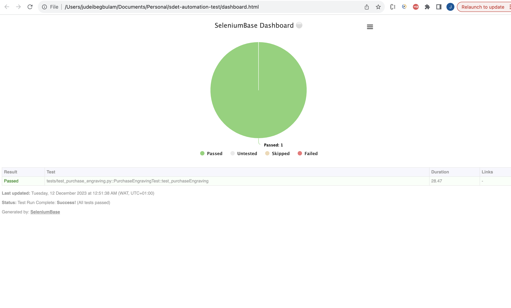
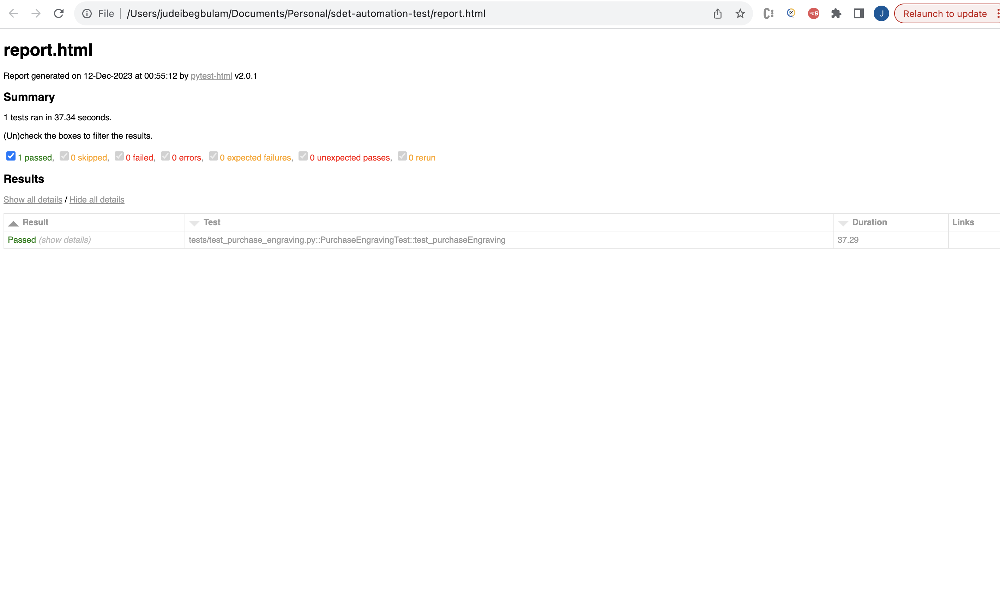
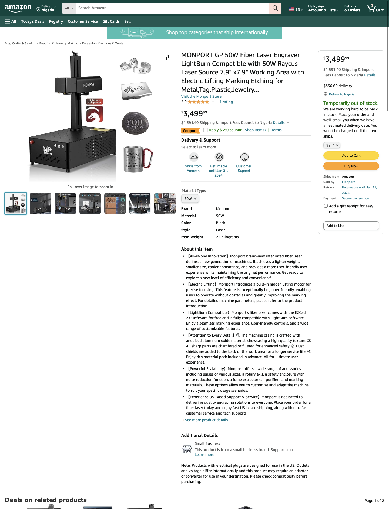

# sdet-automation-test
This test automation was implemented using the SeleniumBase.
SeleniumBase is a framework that is built with `python`, `pytest`, and `webdriver`.

## SETUP
In order to setup this application, <code>python</code> has to be installed on the local machine. After python has been installed, it comes with an inbuilt package manager called <code>pip</code>.

You can also setup your virtual environment just like mine so that you can have an isolated space for your setups, installations, scripts and libraries.

Using pip, install the following tools and packages by running the following commands in the terminal:
1. Install selenium base: <code>pip3 install seleniumbase</code> (to verify after installation, enter `seleniumbase` into the terminal)
2. Install chromedriver: <code>sbase install chromedriver latest</code> (you can also install other driver based on your preference. However, for this test, i will be using chromedriver).


## HOW TO RUN

#### If you want to run all test, navigate to the project root via the terminal, and type: 
```sh
pytest 
```
#### or if you want to run a specific test
```sh
pytest -k (test_name) -s
```

#### If you want to run tests with logs displaying, you should type: 
```sh
pytest -s 
```

#### If you want to run test in headless mode, you should type: 
```sh
pytest -s --headless 
```

#### If you want to run tests with a specific browser, you should type: 
```sh
pytest -s --browser=firefox 
```

#### If you want to run tests with a dashboard report, you should type: 
```sh
pytest -s --dashboard 
```

#### If you want to run tests with a html report, you should type: 
```sh
pytest -s --html=report.html 
```

## Implementation:
This automation framework follows `Page Object Model` pattern.

The main class `test_purchase_engraving.py` inside the tests package is where we call the test and test cases. 
The pages package contains the classes for the various pages, each of these class object inherits `BaseCase`, and contains the elements and methods for various actions. 
These page objects `StartBrowser`, `HomePage`, `SideMenu`, `EngravingPage` were then injected into the `PurchaseEngravingTest()` class, giving it access to all the test cases and elements.

```python
class PurchaseEngravingTest(StartBrowser,HomePage,SideMenu,EngravingPage):

    def setUp(self):
        super().setUp()
        StartBrowser.setUp(self)
        HomePage.setUp(self)
        SideMenu.setUp(self)
        EngravingPage.setUp(self)

        print("PurchaseEngravingTest *STARTS*")
        self.launch_browser()
        self.verify_page_title()
        self.verify_logo_is_present()
```

```python
    def test_purchaseEngraving(self):
        self.click_dropdownMenuOption()
        self.click_artsAndCraftOption()
        self.click_beadingAndJewelryOption()
        self.click_artsAndCraftAndSewingOption()
        self.click_beadingAndJewelryMakingOption()
        self.click_engravingMachinesAndToolsOption()
        self.click_sortByDropdown()
        self.select_sortByHighToLowOption()
        self.click_resultThirdOption()
        self.validate_ratingIsAboveFour()
        self.validate_priceValue()
```

## Reports and Dashboard
* SeleniumBase automatically generates the reports after the first run with <code>dashboard</code> or <code>html</code> command. Instructions for this, is in the How To Run section.
* To view the reports after a test run, you can select one of the two options <code>dashboard.html</code> and <code>report.html</code> found in the root folder by default
* After the test run is completed using the reporting command, a file url is generated and displayed either at the beginning or at the end of the test run inside the terminal. This url opens the report in the browser.

`dashboard_report`

`html_report`


## Screenshots
* SeleniumBase also automatically generates a screenshot for you after a fail test.
* The screenshot <code>screenshot.png</code> can be found inside the folder: `latest_logs` and `assets`.
* Also included is the webpage screenshot <code>page_source.html</code>, displaying the page where your test failed.
* `N/B` The `latest_logs` folder alongside the screenshot is created after a failed test run


